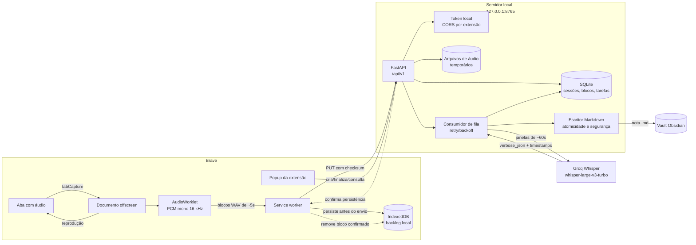

# StudyCapture

O StudyCapture captura o áudio da aba ativa do Brave, envia o áudio para um servidor local, transcreve a aula usando a Groq e salva uma nota Markdown no Obsidian.

Ele foi pensado para aulas, cursos, reuniões e vídeos que você queira revisar depois, mantendo o áudio, a transcrição e os arquivos de controle na sua máquina.

## O que ele faz

- Captura o áudio de uma aba do Brave sem depender do popup ficar aberto.
- Mantém o áudio audível durante a captura.
- Converte o áudio para PCM mono, 16-bit, 16 kHz.
- Divide a captura em blocos de aproximadamente cinco segundos.
- Persiste os blocos no IndexedDB antes de enviá-los.
- Reenvia blocos quando o servidor ou a rede ficam indisponíveis.
- Permite pausar e retomar a captura manualmente.
- Pausa automaticamente quando detecta que um vídeo HTML5 foi pausado ou terminou.
- Transcreve em janelas de aproximadamente 60 segundos, com contexto sobreposto.
- Usa `whisper-large-v3-turbo` da Groq, com timestamps de segmentos e palavras.
- Salva uma única nota Markdown no vault do Obsidian.
- Mantém as respostas originais da transcrição para diagnóstico e reconstrução.
- Evita sobrescrever notas existentes, criando sufixos numéricos quando necessário.

O conteúdo não é resumido, traduzido ou interpretado. A saída é uma transcrição bruta com timestamps relativos ao início da captura.

## Como funciona

```text
Brave / aba ativa
        │
        ▼
Extensão MV3
  popup + service worker + offscreen document
        │  blocos PCM/WAV persistidos
        ▼
Servidor local em 127.0.0.1:8765
  FastAPI + SQLite + fila de tarefas
        │
        ▼
Groq Whisper
        │
        ▼
Nota Markdown no Obsidian
```

### Componentes

- `extension/`: extensão Manifest V3, popup, página de opções, service worker, IndexedDB e `AudioWorklet`.
- `server/`: API FastAPI, autenticação por token local, SQLite, fila, transcrição e gravação no vault.
- `systemd/`: unidade de serviço de usuário para iniciar o backend automaticamente.
- `tests/`: testes automatizados do backend.

### Diagrama de arquitetura



### Responsabilidade de cada camada

| Camada | Responsabilidade |
| --- | --- |
| Popup | Configurar título, idioma e pasta; iniciar e finalizar sessões; mostrar andamento. |
| Documento offscreen | Permanecer ativo quando o popup fecha e capturar o áudio da aba. |
| AudioWorklet | Converter o fluxo de áudio em amostras PCM e fechar blocos de transporte. |
| Service worker | Persistir o backlog no IndexedDB, enviar blocos e repetir falhas. |
| FastAPI | Autenticar chamadas, validar metadados, receber blocos e expor o estado da sessão. |
| SQLite | Guardar sessões, checksums, tarefas, janelas e respostas originais. |
| Fila local | Aguardar blocos, agrupar janelas, chamar a Groq e recuperar tarefas após reinícios. |
| Escritor Markdown | Montar a nota, sanitizar o nome, resolver colisões e publicar atomicamente. |

## Requisitos

- Linux com `systemd --user`.
- Python 3.11 ou mais recente.
- Node.js 20 ou mais recente.
- Brave ou Chromium com suporte a Manifest V3, `tabCapture` e `AudioWorklet`.
- Uma chave da Groq para transcrição real.
- Um vault do Obsidian.

O caminho padrão configurado neste ambiente é:

```text
/home/olucasdev/Documentos/Obsidian Vault
```

É possível usar outro caminho passando `--vault` no comando de configuração.

## Instalação do backend

Execute a partir da raiz do projeto:

```bash
cd /home/olucasdev/Documentos/projects/study-capture

python -m venv .venv
source .venv/bin/activate
python -m pip install --upgrade pip setuptools wheel
python -m pip install -e '.[dev]'
```

Se o `pip` informar erro de DNS ou não conseguir acessar `pypi.org`, verifique a conexão com a internet e repita a instalação.

## Build da extensão

```bash
cd /home/olucasdev/Documentos/projects/study-capture/extension
npm install
npm run build
```

O diretório carregado no Brave será:

```text
/home/olucasdev/Documentos/projects/study-capture/extension/dist
```

## Instalação no Brave

1. Abra `brave://extensions`.
2. Ative o “Modo do desenvolvedor”.
3. Clique em “Carregar sem compactação”.
4. Selecione `extension/dist`.
5. Copie o ID mostrado no cartão da extensão.

O ID tem 32 caracteres, por exemplo:

```text
kncccoifengfafjabdibdopcddbpilci
```

Sempre que o código da extensão for recompilado, clique em “Recarregar” no cartão do StudyCapture.

## Configuração inicial

Com a extensão já carregada, execute na raiz do projeto:

```bash
cd /home/olucasdev/Documentos/projects/study-capture
source .venv/bin/activate

python -m server.studycapture.cli configure \
  --groq-key "SUA_CHAVE_GROQ" \
  --extension-id "ID_DA_EXTENSAO"
```

O comando:

- cria `~/.config/studycapture/config.env`;
- gera um token local para a extensão;
- configura o vault;
- instala e habilita `studycapture.service`;
- cria o autostart do Brave com a extensão compilada;
- tenta habilitar o serviço para iniciar durante o boot.

O token impresso no final deve ser informado na página de opções da extensão:

1. Abra `brave://extensions`.
2. Abra os detalhes do StudyCapture.
3. Clique em “Opções”.
4. Cole o token no campo “Token local”.
5. Salve.

O arquivo de configuração contém a chave da Groq e tem permissão restrita. A chave nunca é enviada para a extensão.

## Inicialização automática

Depois da configuração, valide o serviço:

```bash
systemctl --user is-enabled studycapture.service
systemctl --user is-active studycapture.service
```

Se o sistema pedir para habilitar o lingering do usuário, execute uma vez:

```bash
sudo loginctl enable-linger "$USER"
```

Isso permite que o serviço do usuário seja iniciado durante o boot, mesmo antes de abrir uma sessão gráfica.

O configurador também cria:

```text
~/.config/autostart/studycapture-brave.desktop
```

Esse arquivo inicia o Brave automaticamente e carrega `extension/dist`. A captura não começa sozinha: você ainda escolhe a aba e clica em “Começar captura”.

## Verificação do servidor

```bash
curl http://127.0.0.1:8765/api/v1/health
```

O resultado esperado é semelhante a:

```json
{"ok":true,"configured":true,"groq":true}
```

Para acompanhar o serviço em tempo real:

```bash
journalctl --user -u studycapture.service -f
```

## Como fazer uma captura

1. Abra uma aula ou vídeo com áudio no Brave.
2. Clique no ícone do StudyCapture.
3. Confira o título obtido da aba.
4. Selecione o idioma: automático, português ou inglês.
5. Escolha a pasta do vault.

As pastas são exibidas de forma hierárquica. Por exemplo:

```text
Raiz do vault
Eu
　Cursos
　　Psicologia
　　　Aulas
```

O valor enviado ao servidor é o caminho relativo completo, como `Eu/Cursos/Psicologia/Aulas`.

6. Clique em “Começar captura”.
7. Feche o popup ou troque de aba, se quiser; a captura continua no documento offscreen.
8. Use “Pausar captura” ou “Retomar captura” quando necessário.
9. Quando terminar, abra o popup e clique em “Finalizar captura”.
10. Aguarde a notificação de nota salva e confira o arquivo no Obsidian.

O popup mostra a duração, os blocos confirmados pelo servidor, os blocos ainda no IndexedDB e o andamento da transcrição. A finalização é processada pelo service worker e pelo servidor local mesmo que o popup seja fechado.

## Formato da nota

Cada nota contém:

- título;
- domínio e URL de origem;
- data e fuso horário;
- duração em segundos;
- observação de que os timestamps são relativos ao início da captura;
- transcrição organizada por segmentos.

Os timestamps usam `MM:SS` e passam para `HH:MM:SS` depois de uma hora.

## Recuperação e segurança

- Uploads repetidos com o mesmo checksum são idempotentes.
- Uma mesma sequência com conteúdo diferente gera conflito.
- Blocos são mantidos no IndexedDB até confirmação do servidor.
- Falhas de rede usam novas tentativas com espera progressiva.
- Respostas 429 respeitam `Retry-After` quando disponível.
- O servidor escuta somente em `127.0.0.1`.
- Todas as operações da extensão usam o token local.
- Caminhos absolutos, `..`, pastas ocultas e links simbólicos são rejeitados.
- A nota é gravada atomicamente e nunca sobrescreve uma nota existente.
- Áudio temporário só é removido depois que a nota é confirmada.
- Sessões com falha preservam metadados e respostas da Groq.

## Teste sem consumir a Groq

Para fazer um teste local usando uma transcrição simulada:

1. Abra `~/.config/studycapture/config.env`.
2. Adicione:

```text
GROQ_MOCK=true
```

3. Reinicie o serviço:

```bash
systemctl --user restart studycapture.service
```

Nesse modo, a nota será criada sem chamada real à Groq.

## Testes automatizados

Backend:

```bash
cd /home/olucasdev/Documentos/projects/study-capture
source .venv/bin/activate
pytest
```

Extensão:

```bash
cd extension
npm test
npx tsc --noEmit
npm run build
```

## Troubleshooting

### `bash: Vault: comando não encontrado`

O caminho do vault contém espaço. Recrie a configuração usando a versão atual do configurador ou deixe a linha assim:

```text
STUDYCAPTURE_VAULT="/home/olucasdev/Documentos/Obsidian Vault"
```

### O popup aparece vazio

1. Confirme que `extension/dist` foi recompilado.
2. Abra `brave://extensions`.
3. Clique em “Recarregar” no StudyCapture.
4. Abra o console do “service worker” no cartão da extensão.

### A captura continua, mas nenhum bloco é enviado

Confira os logs:

```bash
journalctl --user -u studycapture.service -n 100 --no-pager
```

Uploads corretos devem aparecer como:

```text
PUT /api/v1/sessions/.../blocks/0 200 OK
```

### Existe uma sessão antiga bloqueando uma nova captura

Liste as sessões:

```bash
source ~/.config/studycapture/config.env
curl -sS \
  -H "X-StudyCapture-Token: $STUDYCAPTURE_TOKEN" \
  http://127.0.0.1:8765/api/v1/sessions
```

Uma sessão presa pode ser marcada como interrompida:

```bash
curl -sS -X POST \
  -H "X-StudyCapture-Token: $STUDYCAPTURE_TOKEN" \
  http://127.0.0.1:8765/api/v1/sessions/ID_DA_SESSAO/interrupt
```

### O serviço não inicia automaticamente

```bash
systemctl --user status studycapture.service
systemctl --user enable --now studycapture.service
sudo loginctl enable-linger "$USER"
```

### Quero iniciar manualmente

```bash
cd /home/olucasdev/Documentos/projects/study-capture
source .venv/bin/activate
set -a
source ~/.config/studycapture/config.env
set +a
uvicorn server.studycapture.main:app --host 127.0.0.1 --port 8765
```

## Limitações atuais

- Uma captura ativa por vez.
- A detecção automática de vídeo depende de o site usar um elemento HTML5 `<video>` acessível à extensão.
- Não há edição da transcrição na extensão.
- Não há resumos, tradução, agentes ou RAG.
- A extensão precisa ser carregada como extensão descompactada.
- O fechamento abrupto do navegador pode perder apenas o bloco que ainda estava em formação.
